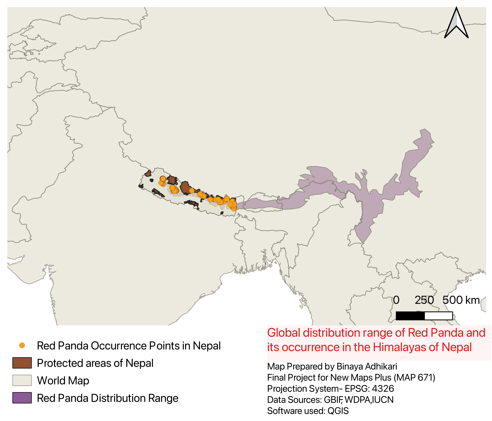

---
---
---

# **Global Distribution of Red Panda and its Occurrence in the Himalayas of Nepal**

## **Data Sources**:

1.  **Red Panda Occurrence Points**:
    -   Collected from the **Global Biodiversity Information Facility (GBIF)** and **personal field-based data**.
    -   [GBIF Link](https://www.gbif.org/)
2.  **Protected Areas of Nepal**:
    -   Downloaded from the **World Database on Protected Areas (WDPA)**.
    -   [WDPA Link](https://www.protectedplanet.net/en/thematic-areas/wdpa?tab=WDPA)
3.  **Global Distribution Range of Red Panda**:
    -   Downloaded from the **International Union for Conservation of Nature (IUCN)**.
    -   [IUCN Red List Link](https://www.iucnredlist.org/resources/spatial-data-download)

## **Why I Created the Map**:

The goal of this project was to create an interactive web-based map that highlights the **global distribution of the red panda**, with a focus on its **occurrence in Nepal's protected areas**. This visualization aims to provide insights into the distribution of the species and its overlap with conservation zones, which is valuable for understanding habitat range and guiding conservation efforts. The map serves as an important tool for researchers, conservationists, and the general public interested in the current state of red panda habitats.

## **How the Map Was Created**:

This project began by gathering relevant data from multiple sources, followed by processing in **QGIS** to prepare it for visualization in **Mapbox**.

Below is the detailed process:

### **1. Data Collection and Preparation in QGIS**:

-   **Occurrence Points**: Red panda occurrence data was collected from GBIF and personal observations. The points were filtered to retain only those within Nepal using the **Clip** tool in QGIS. The resulting data was exported as a **GeoJSON** file.

-   **Protected Areas**: The protected areas shapefile from WDPA was filtered for Nepal using the **Clip** tool. Since the shapefile contained multiple categories of protected areas, I used the **Union** tool to merge these categories into a single shapefile, which was then exported as **GeoJSON**.

-   **Global Distribution Range**: I loaded the IUCN global distribution shapefile for red pandas and clipped it to focus on Nepal before exporting it as **GeoJSON**.

### **2. Map Design and Layer Styling in Mapbox**:

-   After preparing the data, I uploaded the **GeoJSON** files as tilesets in **Mapbox Studio**.

-   I used the **standard satellite basemap** for visualization, which provides a natural background for geographic features.

-   A **Digital Elevation Model (DEM v1)** layer was added to enhance the visualization of terrain. The **intensity of the DEM** changes based on zoom level, providing a dynamic feel.

-   **Protected Areas** were styled with varying **opacity and boundary width** to visually distinguish the different zones. Labels were added for protected areas by duplicating the layer and using the **text field** for names. The text attributes, including **color, font, and size**, were customized for clarity.

-   **Red Panda Occurrence Points**: These were visualized as a **heatmap** to highlight areas of high density. The **radius, intensity, and color** of the heatmap were adjusted for aesthetic and functional purposes.

-   I also uploaded a **red panda silhouette icon** (converted from PNG to SVG) and used it to represent each occurrence point. I adjusted the **icon size and opacity** to ensure it integrated smoothly with the map's overall style.

### **3. Land Use and Cover Visualization**:

-   I added the **Mapbox Terrain v2** layer to visualize land use and cover in Nepal. Different land use categories (e.g., **wood, scrub, grass, snow**) were colored using a gradient of **greens to lighter shades**. The opacity of these layers changes based on zoom levels, allowing users to explore the landscape interactively.

## **Projection Information**:

-   **Original Data Projection**: The original data for the red panda occurrence points and protected areas were in the **WGS 84 (EPSG:4326)** projection, which is standard for geographic datasets.

-   **Final Projection**: The data was maintained in **WGS 84** for integration into **Mapbox**, which uses this projection for all web-based maps.

## **Link to Map and Resources**:

-   **[[Link to the interactive map](https://binayaadh.github.io/redpanda-distribution/)]** 
-   The full dataset and files used in this project can be accessed through the sources mentioned above, or included as part of the project repository on **GitHub**.

## **Map Features**:

-   **Location**: Focused on the **Himalayas of Nepal**.
-   **Global range**: Displayed using polygon.
-   **Red Panda Occurrence**: Displayed using both a **heatmap** and **custom symbol**.
-   **Protected Areas**: Highlighted with labels and styled boundaries.
-   **Terrain**: Enhanced with DEM and land-use layers to reflect elevation and land cover.

## **Conclusion**:

This map successfully visualizes the **global distribution** and **Nepal-specific occurrence** of red pandas. By combining multiple datasets, geoprocessing techniques, and advanced styling in Mapbox, this interactive map provides valuable insights for both research and conservation efforts related to the red panda.
